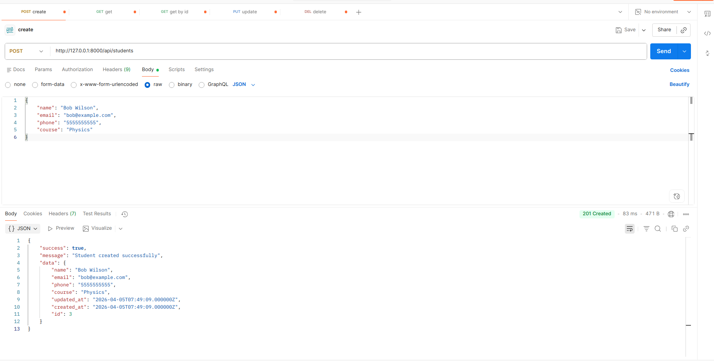
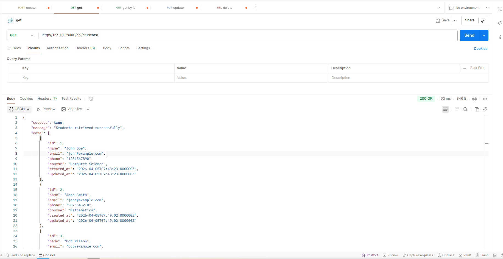
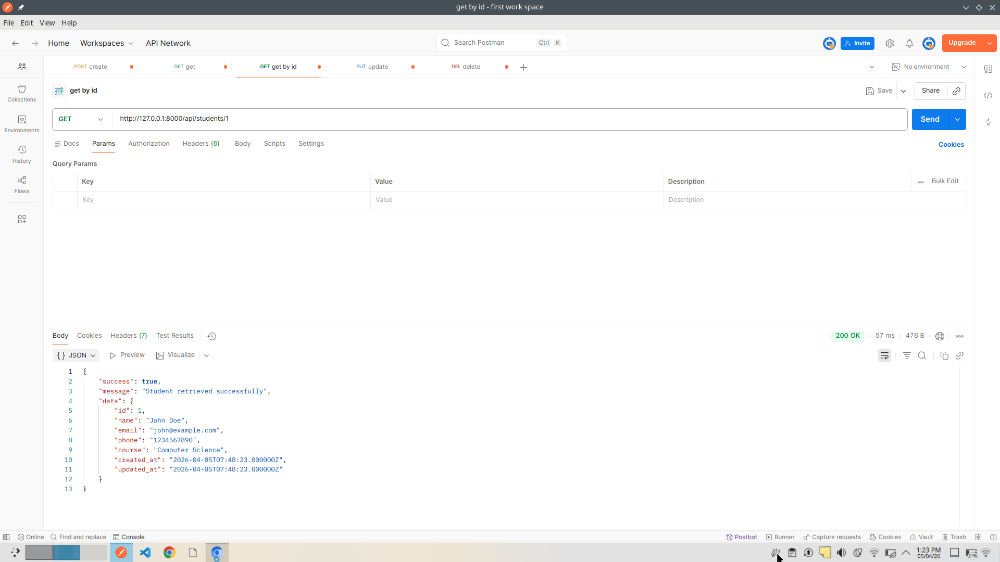
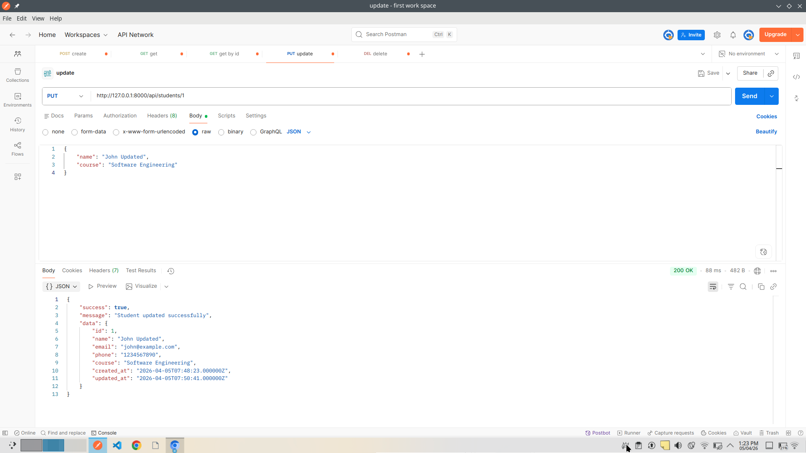
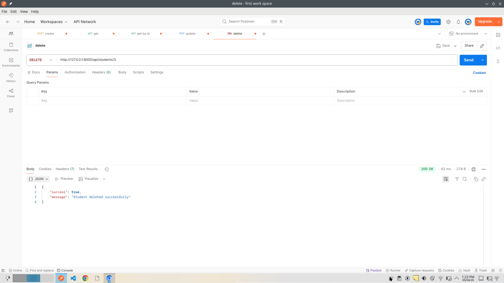

# Student Management

```
Name: Mahmadhadi Naynai;
Er no: 20230905090039;
Sub: WDF | ALA3;
Marks: 10 / 10 :)
```

## Features

- Create Student
- Get All Students  
- Get Single Student
- Update Student
- Delete Student
- Input Validation
- JSON Responses with HTTP Status Codes

## Screen shots
### 1. Create Student

---
### 2. Get All Students
 
---
### 3. Get Student By Id
 
---
### 4. Update Student
 
---
### 5. Delete Student

---

## Technologies

- Laravel 13
- SQLite
- REST API

## Installation

1. composer install
2. cp .env.example .env
3. touch database/database.sqlite
4. Set DB_CONNECTION=sqlite in .env
5. php artisan key:generate
6. php artisan migrate
7. php artisan serve

## API Endpoints

| Method | Endpoint | Description |
|--------|----------|-------------|
| POST | /api/students | Create student |
| GET | /api/students | Get all students |
| GET | /api/students/{id} | Get one student |
| PUT | /api/students/{id} | Update student |
| DELETE | /api/students/{id} | Delete student |

## Sample Requests

### Create Student
```
POST /api/students
{
    "name": "John Doe",
    "email": "john@example.com", 
    "phone": "1234567890",
    "course": "Computer Science"
}
```

### Get All Students
```
GET /api/students
```

### Get Single Student
```
GET /api/students/1
```

### Update Student
```
PUT /api/students/1
{
    "name": "John Updated",
    "course": "Software Engineering"
}
```

### Delete Student
```
DELETE /api/students/1
```

## HTTP Status Codes

- 200 OK - Success
- 201 Created - Student created
- 404 Not Found - Student not found
- 422 Validation Error - Invalid input

## Database Schema

- id (primary key)
- name
- email (unique)
- phone
- course
- created_at, updated_at

## Author

- Mahmadhadi Nayani
- Er no: 202309050900`39`
- Subject: WDF | ALA3


## GitHub Repository

[/mahmadhadi/wdf3](https://github.com/MahmadHadi/wdf3)
